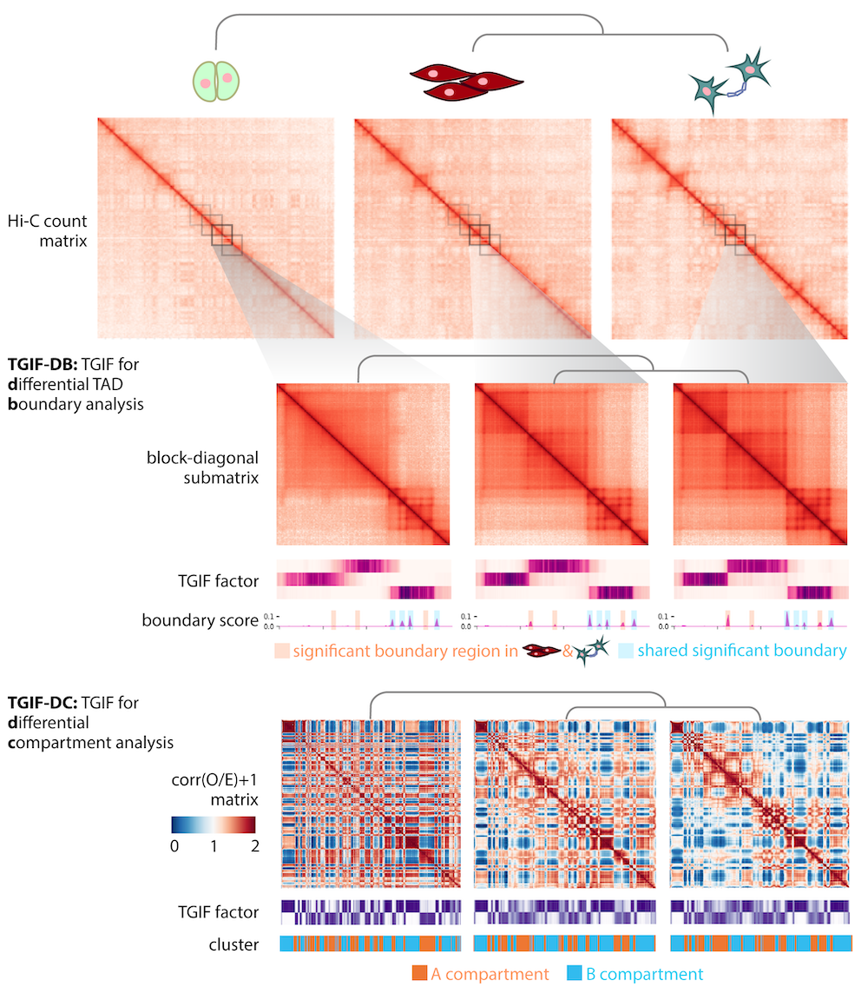

### Tree-Guided Integrated Factorization (TGIF) to identify conserved & differential genome organization

[](http://perso.crans.org/besson/LICENSE.html)
[](https://github.com/Roy-lab/grinch/releases/tag/v1.0.0)

TGIF applies multi-task non-negative matrix factorization (NMF) to multiple input Hi-C matrices to identify conserved or dynamic compartment and TAD boundaries.

- [Install](#install)
- [Run TGIF-DB for differential TAD boundary identification](#run-tgif-db)
- [Run TGIF-DC for differential compartment identification](#run-tgif-dc)



## Install 

Installation instructions below were tested in Linux Centos 7 distribution. [GSL (GNU Scientific Library) 2.7](https://www.gnu.org/software/gsl/doc/html/index.html) is used to handle matrix- and vector-related operations. Older versions of GSL (even 2.6) will not work since we use newly added functions. 

1. __If you already have GSL 2.7 installed__, edit the first few lines of the Makefile to point to the correct include and shared library directory, then jump to step 3.
```
#CHANGE PATHS AS NEEDED:
INCLUDE_PATH = ${CONDA_PREFIX}/include
LIBRARY_PATH = ${CONDA_PREFIX}/lib
```
2. __If you do not have GSL 2.7 installed, or you are not sure__, one way to get it installed is to use [conda](https://anaconda.org/conda-forge/gsl/):
```
conda install -c conda-forge gsl
```
3. Make sure to add the location of the installed shared library to where the compiler/linker will be looking. If you used conda to install GSL to the default location in step 2, run the following command after activating the appropriate environment (or add the appropriate path if you already have GSL installed):
```
export LD_LIBRARY_PATH=${LD_LIBRARY_PATH}:${CONDA_PREFIX}/lib
```
4. And let's install! In the same directory you downloaded the code/Makefile (either by cloning the repository or by downloading a release), run:
```
make tgif
```
5. If all went well, you won't get any alarming messages, and you will see an executable named `run_tgif` created in the same directory. A quick test below will print the manual for running TGIF:
```
./tgif-db -h
```

Note: in order to implement NNDSVD initialization of factors, a fast randomized SVD algorithm from [RSVDPACK](https://github.com/sergeyvoronin/LowRankMatrixDecompositionCodes) was used. A minor modification to allow random seed specification was made to the original code from [RSVDPACK](https://github.com/sergeyvoronin/LowRankMatrixDecompositionCodes/tree/main/single_core_gsl_code). This updated code is included under modules/random_svd directory. Compilation of this code is part of the included Makefile; no additional step is necessary for installation.

## Run TGIF-DB

TGIF-DB identifies conserved and dynamic TAD boundary regions.

### Basic usage
```
./tgif-db input/tgif-db/chr19_tree.txt input/tgif-db/chr19_25kb.bed -o output/tgif-db/
./tgif-db input/tgif-db/chr19_tree.txt input/tgif-db/chr19_25kb.bed -k 5 -o output/tgif-db/k5_
```
- `input/tgif-db/chr19_tree.txt` specifies the tree file, which contains file locations to individual task matrices (paths are relative to location of run_tgif executable location; more details below). 
- `input/tgif-db/chr19_25kb.bed` is a bed file specifying the start and end coordinates of each bin whose index is referred to in the sparse-format matrix files (more details below).
- Optional: `-k 5` By default, TGIF-DC operates with k=2 and finds 2 clusters of genomic regions that correspond to A or B compartments. To find subcompartments, i.e., more granular clusters, specify a higher k.
-	Optional: `-o output/tgif-db/` will put all output files to output/tgif-db/ directory. By default the output files will be saved to the current directory. Check out the example output directory in the repo.


### Input tree file format
- This file specifies the task hierarchy, where each task represents some biological condition and has its own input matrix.
- See example in [input/tgif-db/chr19_tree.txt](https://github.com/Roy-lab/tgif/blob/main/input/tgif-db/chr19_tree.txt).
```
1	5	ES	input/tgif-db/ES_chr19_25kb.txt
2	4	NPC	input/tgif-db/NPC_chr19_25kb.txt
3	4	CN	input/tgif-db/CN_chr19_25kb.txt
4	5	branch1	N/A
5	-1	root	N/A
```
All 4 columns are required. If you want a flat tree or do not care about the task hierarchy, point all nodes to have the root node as the parent. If you'd like a tree structure suggested based on the structural similarity of the input matrices, see [suggest_tree/](https://github.com/Roy-lab/tgif/tree/main/suggest_tree).
- Column 1: **node ID**; start from 1 and move up.
- Column 2: **parent node ID**; right now the implementation will only work correctly if you ID all children nodes before a parent node (so start from the lowest depth of tree, move to next level, till you hit the root, which should be the last node ID.)
- Column 3: **node alias**, used to refer to each input matrix/task in the output files.
- Column 4: **location of input matrix file for leaf nodes**, relative to where the run_tgif executable is. Set as N/A for non-leaf nodes.

### Input matrix file format
- Each of the matrix files referred to in the tree file.
- 0-indexed, tab-delimited, sparse-matrix format, no header
- Column 1: index of region or bin A
- Column 2: index of region or bin B
- Column 3: interaction count between bin A and B
- See example in [input/tgif-db/ES_chr19_25kb.txt](https://github.com/Roy-lab/tgif/blob/main/input/tgif-db/ES_chr19_25kb.txt).
```
0       0       4454.112629
0       1       1280.765686
1       1       4216.131160
...
```

### Input coordinates file format
- This file specifies the starting and ending coordinates of each bin whose index is referred to in the matrix files.
- The matrices are 0-indexed (i.e. first entry index is [0,0]) and they must share a common coordinates file.
- Tab-delimited
- Column 1: chromosome
- Column 2: bin start coordinate
- Column 3: bin end coordinate
- Column 4: bin index (starting at 0)
- See exmaple in [input/tgif-db/chr19_25kb.bed](https://github.com/Roy-lab/tgif/blob/main/input/tgif-db/chr19_25kb.bed).
```
19      3075000 3100000 0
19      3100000 3125000 1
19      3125000 3150000 2
19      3150000 3175000 3
...
```

### Optional parameters
| Position | Parameter                    | Description                                                                                                                                                                                | Default Value/Behavior                    |
|:--------:|------------------------------|--------------------------------------------------------------------------------------------------------------------------------------------------------------------------------------------|-------------------------------------------|
|     1    | <input tree file>            | This file specifies the task hierarchy, where each task represents some biological condition and has its own input matrix. See  documentation above for more details, format, and example. | N/A                                       |
|     2    | <input coordinates bed file> | This is a mapping each index in the input matrix file to a chromosomal coordinate. See documentation above for more  details, format, and example.                          | N/A                                       |
| optional | -o <output path and prefix>  | Output file path and prefix. Note: will NOT create a directory if the specified directory does not already exist.                                                                          | Output files saved to current  directory. |
| optional | -l                           | Generate a file called parameters.log under the specified output path (or current directory by default) that lists the parameter settings used.                                            | No log file of parameters saved.          |
| optional | -b                           | Generate files boundary_score.txt and background_score.txt under the  specified output path (or current directory by default).                                                             | No boundary-score related files  saved.   |
| optional | -p                           | Generate files boundary_pval.txt and boundary_adj_pval.txt under the  specified output path (or current directory by default).                                                             | No p-value related files saved.           |
| optional | -w <window size>             | Specify, in number of basepairs (e.g. 2000000), the size of the "window" or the dimension of the submatrices where factorization will be applied.                                          | 2000000 (i.e., 2MB)                       |
| optional | -s <step size>               | Specify, in number of basepairs (e.g. 1000000), the size of the step size for sliding down the block diagonal of the input matrix to generate each  set of submatrices.                    | 1000000 (i.e., 1MB)                       |
| optional | -a <alpha>                   | Specify an integer value used for the strength of the tree regularization.                                                                                                                 | 1000000                                   |
| optional | -t <threshold>               | 	Used to filter out sparse regions with very few interaction counts. If the threshold value is 0.5 and the window size is 2000000 (i.e. 2MB), regions that has fewer than half of its neighbors within 2MB radius are filtered out before applying TGIF-DB. If the input matrices are sparse (e.g. total read depth is less than a billion in any of the matrices) AND you want to apply TGIF-DB to a relatively high resolution (e.g. 10kb), we recommend lowering the threshold to 0.2.                                                                                                                                 | 0.5                                |

### While running...
The program will print its execution progress while it runs and print the total time (in seconds) and max memory (in MB) consumption at the end. 
```
Reading in input files...
Performing TGIF...
[>                                                                     ] 1%
[===>                                                                  ] 5%
[======>                                                               ] 9%
[==========>                                                           ] 15%
[=====================>                                                ] 31%
[================================>                                     ] 47%
[============================================>                         ] 63%
[========================================================>             ] 80%
[===================================================================>  ] 96%
Testing for significant boundaries...
Total time elapsed: 213 seconds
Memory usage: 241MB
```

### Output file 1: significant boundaries
- A bed file called `significant_boundaries_summit_only.txt` denotes the boundary status of each region.
- Each row = a genomic region.
- Each column = each of the input matrix/condition.
  - 0 = non-boundary;
  - 1 = significant boundary;
  - N/A = given region was filted out due to sparsity.
- See example in [output/tgif-db/significant\_boundaries_summit_only.txt](https://github.com/Roy-lab/tgif/blob/main/output/tgif-db/significant_boundaries_summit_only.txt).
- NOTE: `significant_boundaries_summit_only.txt` marks only the region with the highest boundary score if a consecutive stretch of regions is flagged as significant boundaries. For the full set of such regions, see `significant_boundaries.txt` file which is also generated by default.
```
#chro	start  end	ES	NPC	CN
19	3075000	3100000	N/A	N/A	N/A	
19	3100000	3125000	N/A	N/A	N/A	
19	3125000	3150000	0	0	0	
19	3150000	3175000	0	0	0	
...
19	3575000	3600000	1	1	1
...
```
In the example output above, chr19 3575000-3600000 is a significant boundary in all three conditions (ES, NPC, CN).

### Output file set 2: pairwise significantly _differential_ boundaries (sigDB)
- For each pair of input matrices or conditions, a bed file `A_vs_B_significantly_differential_boundary_regions.txt` is generated, listing only regions that are sigDB in the pairwise comparison of A and B.
- Column 1: chromosome
- Column 2: bin start coordinate
- Column 3: bin end coordinate
- Column 4: absolute difference in boundary score between conditions A and B being compared
- Column 5: p-value of the absolute difference
- Column 6: adjusted p-value after FDR correction
- See example in [output/tgif-db/ES_vs_CN_significantly_differential_boundary_regions.txt](https://github.com/Roy-lab/tgif/blob/main/output/tgif-db/ES_vs_CN_significantly_differential_boundary_regions.txt).
```
#chro	start	end	|diff|	pval	padj
19	4250000	4275000	0.019795	0.000351258	0.00195699	
19	4750000	4775000	0.0195557	0.000418252	0.00202151	
19	6350000	6375000	0.0432202	2.64661e-16	0.000430108
```
In the example shown above, the genomic region chr19:4250000-4275000 contains a sigDB between ES and NPC condition.

### Optional output files

#### boundary scores
Using the `-b` flag, the user can print the boundary score for each region and for each task to `boundary_score.txt` file.  The format is the same as `significant_boundaries_summit_only.txt` file, but each entry is a boundary score instead. Also, the scores used as the null distribution to test each boundary score's significance will be saved to `background_score.txt`.

#### boundary p-values
Using the `-p` flag, the user can print the p-values of each boundary score to `boundary_pval.txt` file. The adjusted p-values after FDR correction is printed to `boundary_adj_pval.txt`. The format is the same as `significant_boundaries_summit_only.txt` file, but each entry is a p-value instead.

#### parameter settings
Using the `-l` flag, the user can save the list of parameter values used in this run of TGIF to `parameters.log` file.
  
## Run TGIF-DC
  
TGIF-DC identifies conserved and dynamic compartment regions. Usage for TGIF-DC is very similar to TGIF-DB, with differences in the optional parameters and the output files.

### Basic usage
```
./tgif-dc input/tgif-dc/chr19_tree.txt input/tgif-dc/chr19_100kb.bed -o output/tgif-dc/
```
- `input/tgif-dc/chr19_tree.txt` specifies the tree file, which contains file locations to individual task matrices (paths are relative to location of run_tgif executable location; more details below). 
- `input/tgif-dc/chr19_100kb.bed` is a bed file specifying the start and end coordinates of each bin whose index is referred to in the sparse-format matrix files (more details below).
-	Optional: `-o output/tgif-dc/` will put all output files to output/tgif-dc/ directory. By default the output files will be saved to the current directory. Check out the example output directory in the repo.


### Input tree file format
- This file specifies the task hierarchy, where each task represents some biological condition and has its own input matrix.
- See example in [input/tgif-dc/chr19_tree.txt](https://github.com/Roy-lab/tgif/blob/main/input/tgif-dc/chr19_tree.txt).
```
1	5	ES	input/tgif-dc/ES_chr19_100kb.txt
2	4	NPC	input/tgif-dc/NPC_chr19_100kb.txt
3	4	CN	input/tgif-dc/CN_chr19_100kb.txt
4	5	neural	N/A	
5	-1	root	N/A
```
All 4 columns are required. If you want a flat tree or do not care about the task hierarchy, point all nodes to have the root node as the parent.
- Column 1: **node ID**; start from 1 and move up.
- Column 2: **parent node ID**; right now the implementation will only work correctly if you ID all children nodes before a parent node (so start from the lowest depth of tree, move to next level, till you hit the root, which should be the last node ID.)
- Column 3: **node alias**, used to refer to each input matrix/task in the output files.
- Column 4: **location of input matrix file for leaf nodes**, relative to where the run_tgif executable is. Set as N/A for non-leaf nodes.

### Input matrix file format
- Each of the matrix files referred to in the tree file.
- 0-indexed, tab-delimited, sparse-matrix format, no header
- Column 1: index of region or bin A
- Column 2: index of region or bin B
- Column 3: interaction count between bin A and B
- See example in [input/tgif-dc/ES_chr19_100kb.txt](https://github.com/Roy-lab/tgif/blob/main/input/tgif-dc/ES_chr19_100kb.txt).
- Note that TGIF-DC assumes these are raw counts. If the input is already normalized O/E counts, use the `-e` flag (refer to the optional arguments section below).
```
0	0	121
0	1	176
1	1	8231
0	2	47
1	2	2442
2	2	31199
0	3	27
...
```

### Input coordinates file format
- This file specifies the starting and ending coordinates of each bin whose index is referred to in the matrix files.
- The matrices are 0-indexed (i.e. first entry index is [0,0]) and they must share a common coordinates file.
- Tab-delimited
- Column 1: chromosome
- Column 2: bin start coordinate
- Column 3: bin end coordinate
- Column 4: bin index (starting at 0)
- See exmaple in [input/tgif-dc/chr19_100kb.bed](https://github.com/Roy-lab/tgif/blob/main/input/tgif-dc/chr19_100kb.bed).
```
19	3000000	3100000	0
19	3100000	3200000	1
19	3200000	3300000	2
19	3300000	3400000	3
...
```

### Optional parameters
| Position | Parameter                    | Description                                                                                                                                                                                | Default Value/Behavior                    |
|:--------:|------------------------------|--------------------------------------------------------------------------------------------------------------------------------------------------------------------------------------------|-------------------------------------------|
|     1    | <input tree file>            | This file specifies the task hierarchy, where each task represents some biological condition and has its own input matrix. See  documentation above for more details, format, and example. | N/A                                       |
|     2    | <input coordinates bed file> | This is a mapping each index in the input matrix file to a chromosomal coordinate. See documentation above for more  details, format, and example.                       | N/A                                       |
| optional | -k <number of subcompartments>  | 	By default, TGIF-DC operates with k=2 and finds 2 clusters of genomic regions that correspond to A or B compartments. To find subcompartments, i.e., more granular clusters, specify a higher k.     | 2 (i.e. find 2 compartments) |
| optional | -o <output path and prefix>  | Output file path and prefix. Note: will NOT create a directory if the specified directory does not already exist.                                                                          | Output files saved to current  directory. |
| optional | -l                           | Generate a file called parameters.log under the specified output path (or current directory by default) that lists the parameter settings used.                                            | No log file of parameters saved.          |
| optional | -a <alpha>                   | Specify an integer value used for the strength of the tree regularization.                                                                                                                 | 1000000                                   |
| optional | -e                           | Use this flag if the input matrices for TGIF-DC are O/E count matrices.                                                                                                        | TGIF-DC assumes input matrices are raw count matrices. |
| optional | -u                           | Generate output files that contain the factors Us and Vs.	                                                                                                                    | No factor files are saved.                             |

### Output file: cluster assignments
- See example in [output/tgif-dc/cluster_assignment.txt](https://github.com/Roy-lab/tgif/blob/main/output/tgif-dc/cluster_assignment.txt) and [output/tgif-dc/k5_cluster_assignment.txt](https://github.com/Roy-lab/tgif/blob/main/output/tgif-dc/k5_cluster_assignment.txt).
- For all settings of k, TGIF-DC returns a `cluster_assignment.txt` file, listing the cluster assignments of each region. 
- Each row = genomic region/bin
- Each input matrix/condition has a column denoting compartment A or B.
- In the example below, TGIF-DC was run with `-k 5` to find subcompartments or more than 2 clusters of regions; chr19 3300000-3400000 belongs to cluster 4 in ES and CN states.
```
#chro	startnd	ES	NPC	CN
19	3000000	3100000	0	0	0	
19	3100000	3200000	0	0	0	
19	3200000	3300000	4	0	0	
19	3300000	3400000	4	0	4	
19	3400000	3500000	4	4	4	
19	3500000	3600000	1	4	1
...
```

### Output file: compartment assignments
- See example in [output/tgif-dc/compartment_assignment.txt](https://github.com/Roy-lab/tgif/blob/main/output/tgif-dc/compartment_assignment.txt).
- Under the default k=2, TGIF-DC returns a `compartment_assignment.txt` file, listing the compartment assignments of each region based on their mean O/E counts.
- Each row = genomic region/bin
- Each input matrix/condition has a column denoting compartment A or B. 
- In the example below, chr19 region 3000000-3100000 belongs to compartment B in ES, NPC, and CN cell states; chr19 region 3200000-3300000 belongs to compartment A in ES and B in NPC, and CN cell states.
```
#chro	start	end	ES	NPC	CN
19	3000000	3100000	B	B	B
19	3100000	3200000	B	B	B
19	3200000	3300000	A	B	B
19	3300000	3400000	A	B	A
19	3400000	3500000	A	A	A
19	3500000	3600000	A	A	A
...
```

### Output file set 2: pairwise significantly differential compartmental regions (_sigDC_)
- For each pair of input matrices or conditions, a bed file `A_vs_B_significantly_differential_compartmental_regions.txt` is generated, listing only regions that are sigDC in the pairwise comparison of A and B.
- Column 1: chromosome
- Column 2: bin start coordinate
- Column 3: bin end coordinate
- Column 4: cosine distance between conditions A and B's latent feature from factor
- Column 5: p-value of the distance
- Column 6: adjusted p-value after FDR correction
- See example in [output/tgif-db/ES_vs_CN_significantly_differential_compartmental_regions.txt](https://github.com/Roy-lab/tgif/blob/main/output/tgif-db/ES_vs_CN_significantly_differential_compartmental_regions.txt).
```
#chro	start	end	|diff|	pval	padj
19	11200000	11300000	0.179182	0.00327075	0.00660377	
19	11800000	11900000	0.230168	0.000107882	0.00463122	
19	14000000	14100000	0.246547	2.97501e-05	0.00394511
```
In the example shown above, the genomic region chr19:11200000-11300000 is a sigDC between ES and CN condition.

### Optional output files

#### factors
Each node in the tree will have a V factor (of size n x 2), and each leaf node in the tree will have a U factor (of size n x 2). Using the `-u` flag, each of these factors will be printed to file. For instance, the U factor for the ES node will be saved to output file `ES_U.txt`; the V factor for the root node will be saved to output file `root_V.txt`.  

#### parameter settings
Using the `-l` flag, the user can save the list of parameter values used in this run of TGIF to `parameters.log` file.
